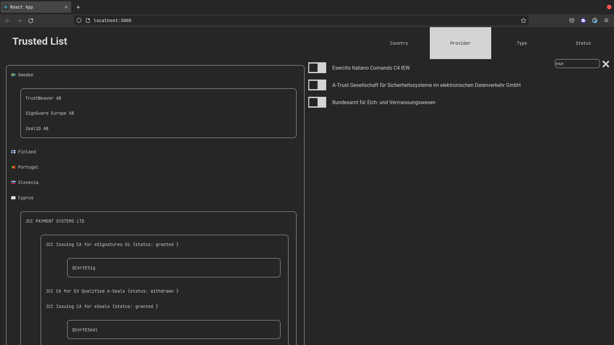

# Trusted list server browser
Application written in Typescript and React, whose purpose is to show the user a list of trusted servers based on the parameters selected by the user with a web-based fancy GUI.

<!-- TABLE OF CONTENTS -->
<details>
  <summary>Table of Contents</summary>
  <ol>
    <li>
      <a href="#getting-started">Getting Started</a>
      <ul>
        <li><a href="#prerequisites">Prerequisites</a></li>
        <li><a href="#installation">Installation</a></li>
      </ul>
    </li>
    <li><a href="#usage">Usage</a></li>
    <li><a href="#visuals">Visuals</a></li>
    <li><a href="#authorsng">Authors</a></li>
    <li><a href="#external-packages">External package</a></li> 
    <li><a href="#license">License</a></li>
  </ol>
</details>

## Getting Started

### Prerequisites
For all os and distros: to use this application you need STABLE INTERNET CONNECTION

#### Windows
* Node.js
  1. Download node (LTS recommend) from [this page](https://nodejs.org/en/download/)
  2. Run `node -v` command on terminal to verify node installed correctly

* yarn
  
  Download yarn from [here](https://github.com/yarnpkg/yarn/releases/download/v1.22.4/yarn-1.22.4.msi)
  
  Run following code on powershell to verify installation
  
  ```
  yarn --version
  ```
  
#### Linux
##### Debian/Ubuntu
* Node.js
  ```sh
  curl -fsSL https://deb.nodesource.com/setup_18.x && sudo apt install -y nodejs
  ```
    Also try command
  ```sh
  node --version
  ```
    to verify Node installed correctly
    
* npm 
    ```sh
    sudo apt install npm
    ```
    
* typescript
  ```sh
  npm install -g typescript
  ```
  
* yarn
  ```sh
  npm install --g yarn
  ```
##### AmogOS

* If you are using the supreme OS (i.e. amogOS, of course) you can follow the instructions for Debian


#### MacOS

* Brew
  ```sh
    /bin/bash -c "$(curl -fsSL https://raw.githubusercontent.com/Homebrew/install/HEAD/install.sh)"
  ```
* Node.js and npm
  ```sh
    brew install node
  ```
    Also try command
  ```sh
  node --version
  npm --version
  ```
    to verify Node installed correctly

* yarn
    ```sh
    npm install -g yarn
    ```
### Installation

1. Open terminal and move to Trusted-list-browser folder
2. run command
    ```
    yarn install
    ```
## Usage
1. Move to Trusted-list-browser folder, then start program using `yarn start` command.
   Now application should start automatically on your default browser.
   If not, open your browser manually then type in the address bar `localhost`
   And you should be connected to the server.

2. From GUI you can select and deselect items from the checkbox list that appears and application will show you a server trusted list based on your previous filter selection

### how to build

if you want to build run from the Trusted-list-browser directory:
    ```
    yarn build
    yarn add serve
    yarn serve build
    ```
## Visuals



## Additional documentation
- [System design](./documentation/system_design.md)
- [System and unit tests](./documentation/tests.md)
- [Code documentation](http://htmlpreview.github.io/?https://github.com/Geostartico/Trusted-list-browser/blob/main/documentation/ts_docs/index.html)

## Authorsng
* [Giovanni Artico](https://github.com/Geostartico)
* [Giulio Codutti](https://github.com/giulpig)
* [Gabriele Miotti](https://github.com/gabriele-0201)
* [Andrea Lupo](https://github.com/LK-parrot)

## External packages
+ Added react-tostify
    + Used to manage on screen notification, like request goes wrong or something like that
+ https://www.npmjs.com/package/allotment
    + Used to manage split view panel
+ test: https://create-react-app.dev/docs/running-tests/
    + yarn add @testing-library/react @testing-library/jest-dom

## License
Distributed under the GPL License. See LICENSE.txt for more information.

## Table of Contents
* [Getting Started](#getting-started)
    * [Prerequisites](#prerequisites)
    * [Installation](#installation)
* [Usage](#usage)
* [Visuals](#visuals)
* [Authors](#authorsng)
* [External Packages](#external-packages)
* [License](#license)
