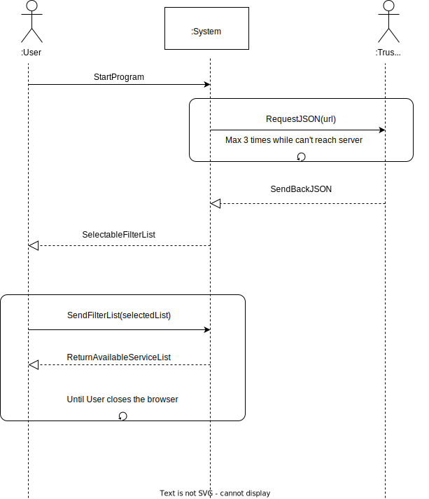

# Search Trusted Server list scenario:
Actors: User and Server

External behaviour:

1. User starts program.
2. System sends JSON request to the Server
   * System repeats this step max 3 times untill Server response is ok
3. If there's no errors Server sends to System a JSON file
4. System shows to the User a list of selectable filters
5. When Users selects an item, System return a list of services based on the filters set above.
   * Step 4 and 5 will loop untill User closes program

