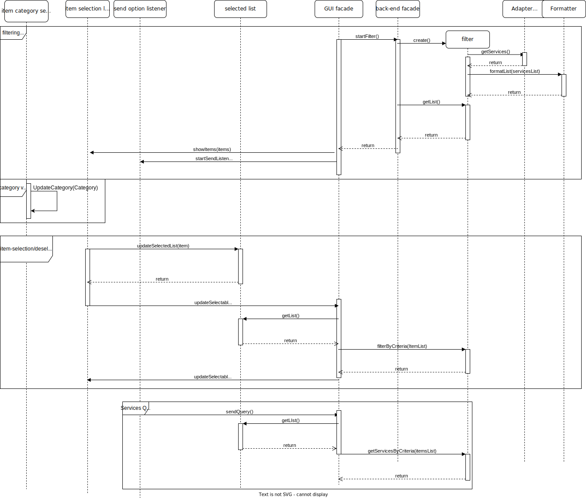

# Internal behaviour diagram

## Initialization

- When the program is launched the **GUI facade** creates the **back-end facade**, which retrieves information about the services via the **fetcher**, to decode with the **decoder** (that turns it into objects). The **GUI facade** then gets the initial information from the **back-end facade** in order to initialise the list of **selected items** and **selectable items**

## List behaviour

- When the program is opened the user has the choice to view **Countries**, **Type**, **Provider**, **Status** list or the types of services list. In this case there is a **category listener**, which changes the viewed list.

## Filtering behaviour

- when an item is deselected or selected the **item selection listener** logs it to the selected list
- when the current selection is completed the **send option listener** notificates the **GUI facade** which send the selected list to the **filter** which filters based on the items type and returns the next batch of selectables, iterating until the services are shown

