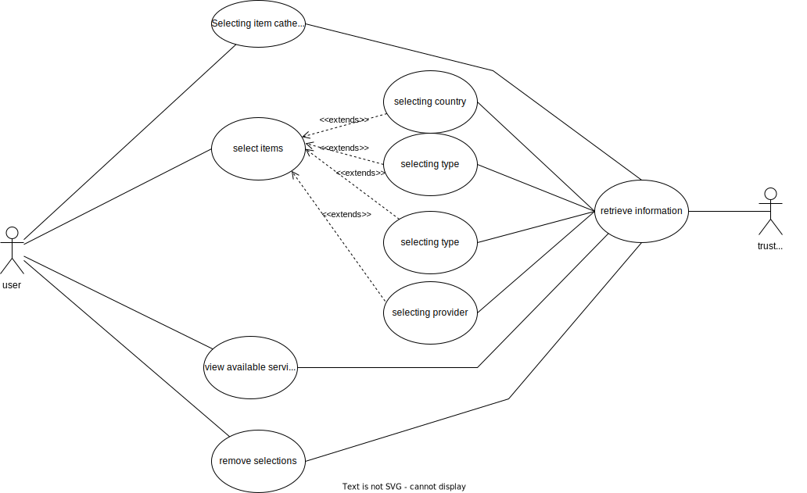

# Use cases

## Requirements

### Mandatory

- Presenting a list of:
  - EU **countries**
  - "**types** of trusted services"
- **Selectioning/Deselectioning** from a list one or more:
  - countries
  - **provider**
  - types of services
  - status of a service
- when a selection is done, the next selections must show a list of only the available selections so that the list of selected services isn't empty
- Creating a query based on the items currently selectioned, returning a list of services

## User-stories

1. a user can choose between type, country, status and provider to filter the services

2. a user can choose to select one or more objects from the list to filter the services

3. a user can deselection an item from the list of items to undo a filtering option

4. the user is shown the available services based on the items they previously selected

5. on selection the user is shown only available further selections

6. if there is an error the user must be informed

## USE CASES

### USE CASE 1: visualising a list of a certain category of items

- description: the user is able to change to choose which category of items to visualise via the interface, thus making able to select items from different categories. In particular, if no selections were made, no filtering was done, therefore all the elements in the provider list must be shown.

- actors:user, trusted-list server

- pre-condition: the program started properly

- acceptance criteria: the program shows the selected list of all the elements of a specific criteria

- Possible errors: unable to connect to the trusted service
actors: user, trusted list server

- actions:
  - the user selects a category

### USE CASE 2: selecting an item (generalized for providers, countries, types, state)

- description: In order to view only specific items the user must have the possibility to filter the items by selecting an item using the given criteria. The items available afterwards must be coherent with the current selections, with rules defined by the filtering algorithm

- precondition: there are items available to be selected

- acceptance criteria: the interface shows only the available selectables given the previous selections and in particular doesn't show an empty list of services

- actors:user, trusted-list server

- actions:

  - the user selects the items on the list

  - the user views the correct services

### USE CASE 3: Remove selection from selected items

- description: the user must be able to remove a filtering item a in order to show the items that do not fit the specific criteria, therefore changing the set of selectable items. if the deselection makes the list of services empty the user must be notified and the deselection mustn't be finalised

- actors:user, trusted-list server

- precondition: the user has already filtered the items by a criteria

- acceptance criteria:
  - if the item was deselectable: the item is no longer selected and the selectable items are coherent with currently selected items
  - if the item wasn't deselectable: the item isn't deselected because it would make the selected list empty(given the rules defined by the filtering algorithm) and the user is notified

- actions:
  - via the interface the user is able to remove the selection from a specific item
  - the user is notified if the deselection wasn't possible

### USE CASE 4: viewing the services

- description: the user is able to visualize the services given the filtered criteria they have chosen, therefore getting the information relating to the item.

- actors:user, trusted-list server

- precondition: the program was initialised correctly

- acceptance criteria: the services (eventually filtered given the criteria) are shown

- actions:
  - none
